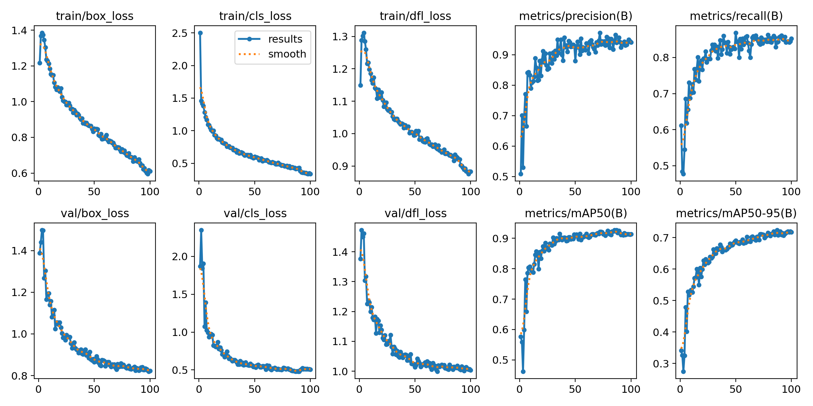
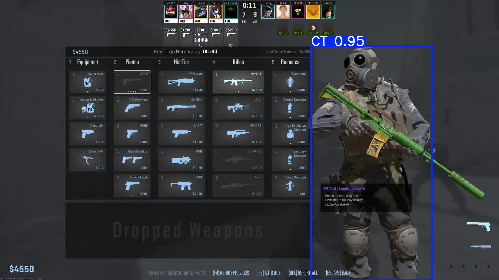
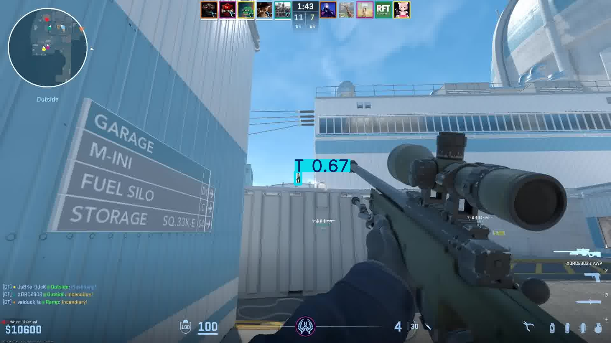
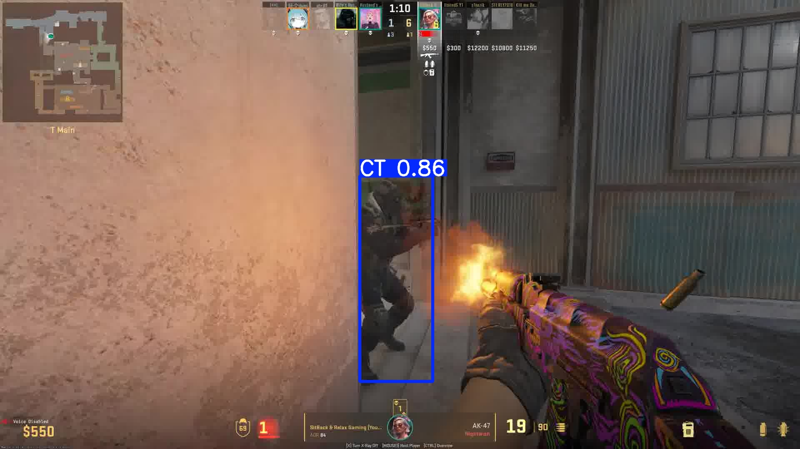
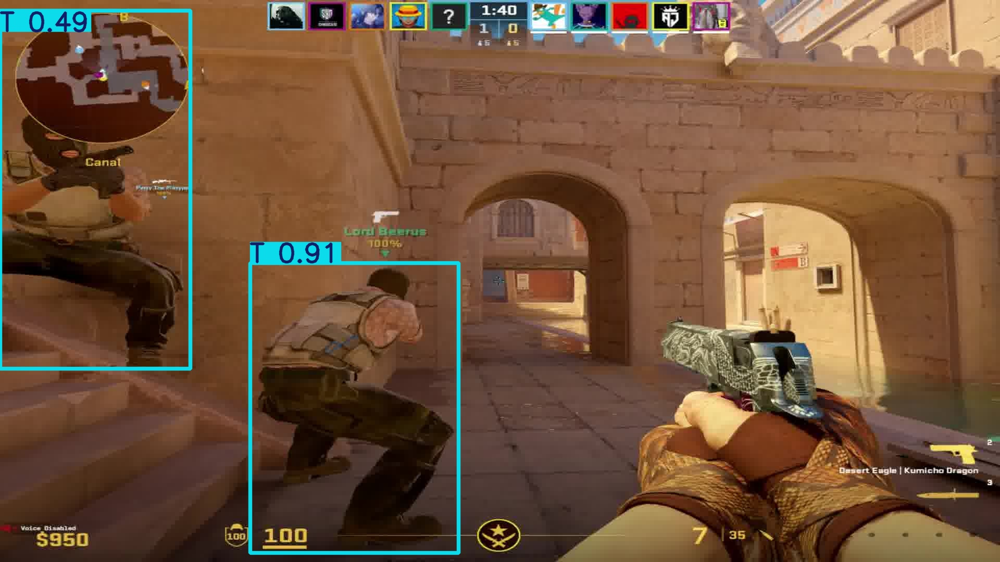

# 🧠 CS2 CT/TERO Detection

> Lightweight AI project to detect and classify Terrorists and Counter-Terrorists in Counter-Strike 2 gameplay, using custom-trained YOLOv5 on real CS2 footage.

---

## 🎯 Project Overview

This project performs object detection on Counter-Strike 2 gameplay footage to identify players as either:

* 🔵 Terrorists (T)
* 🔶 Counter-Terrorists (CT)

It leverages a yolo11 model trained on real game data collected and labeled from the current map pool. The detector processes videos and returns a labeled version with bounding boxes around each identified player.

---

## 🚀 Features

* 🎥 Video-based object detection (offline inference)
* 🧠 Custom yolo11 model trained on labeled gameplay footage
* 📸 Generates labeled video frames or full videos with bounding boxes
* 📦 Deployable as a local script (CLI)

---

## 🗂 Dataset Preparation Workflow

### 🎮 Map Pool

The dataset was built using replays from the official CS2 map pool as of early 2025:

* Dust2
* Mirage
* Nuke
* Ancient
* Anubis
* Inferno
* Train

### 🎥 Frame Extraction

Two gameplays per map were used (14 demos total). From each, frames were extracted at a rate of **1 frame per minute** using `ffmpeg`:

```bash
ffmpeg -i match_demo.mp4 -vf fps=1 frames/mapname_%04d.png
```

This generated approximately 2000 frames per video.

### 🚩 Frame Filtering

To remove uninformative frames (scoreboards, blank screens, etc.), a custom filtering script was written. Final dataset:  **~2400 high-quality frames** , down from ~30,000 raw frames.

Script available here: `tools/filter_frames.py`

### 🏷️ Annotation Process

* Used **LabelStudio** ([labelstud.io](https://labelstud.io/)) for manual labeling
* Leveraged **LabelStudio ML Backend** ([GitHub](https://github.com/HumanSignal/label-studio-ml-backend)) with a model pre-trained on 100 images to assist annotation
* Labels: CT, T

---

## 🧠 Model Training

* Model: yolo11s (Ultralytics)
* Epochs: 100
* Input Size: 640x640
* Framework: Google Colab

Colab notebook used for training: [EdjeElectronics YOLO Colab](https://colab.research.google.com/github/EdjeElectronics/Train-and-Deploy-YOLO-Models/blob/main/Train_YOLO_Models.ipynb)

### 📊 Training Metrics



The training curves indicate:

* 📉 Losses (box, cls, DFL) consistently decrease across training and validation.
* ✅ Precision and recall stabilize around ~0.90 after 50 epochs.
* 📈 Final mAP50 peaks near  **0.92** , while mAP50–95 reaches  **~0.71** , indicating reliable bounding box accuracy and class separation.

These results are encouraging for a lightweight, fast-inference model trained on a small, curated dataset.

---

## 🛠️ Usage

### 1. Clone the repository

```bash
git clone https://github.com/moijesuis2enmoi/cs2-ct-tero-detector.git
cd cs2-ct-tero-detector
```

### 2. Install dependencies

```bash
pip install -r requirements.txt
```

If you have an NVIDIA GPU, install the GPU-enabled version of PyTorch:

```bash
pip install --upgrade torch torchvision torchaudio --index-url https://download.pytorch.org/whl/cu124
```

### 3. Run detection on a video file

```bash
python detect.py --source path/to/cs2_video.mp4 --weights model.pt
```

The output will be saved in the `runs/detect/` directory.

> 📎 This is a lightweight prototype designed for portfolio/demo purposes. Accuracy may vary by map, skin, lighting, and POV. Detection is limited to what the dataset covers. Potential for extension into real-time systems with tracking, webcam input, or stream overlays.

---

## 🧪 Real-Time Detection (Optional)

Once the model is trained (`best.pt`), you can run live inference with:

```bash
python detect.py --model runs/detect/train/weights/best.pt --source screen1 --resolution 1280x720
```

### Available options:

| Argument         | Description                                                               |
| ---------------- | ------------------------------------------------------------------------- |
| `--model`      | Path to trained YOLO model (.pt file)                                     |
| `--source`     | Input source: image, folder, video,`usb0`,`picamera0`, or `screen1` |
| `--thresh`     | Confidence threshold (default:`0.5`)                                    |
| `--resolution` | Force video stream resolution (e.g.,`1280x720`)                         |
| `--record`     | Record output video (requires a resolution to be set)                     |

### Runtime Controls

* `Q`: Quit
* `S`: Pause
* `P`: Save a screenshot (`capture.png`)

---

## 📸 Examples

Here are some example outputs from the detector:





---

## 📂 Project Structure

```
├── model.pt               # Trained yolo11 weights
├── detect.py              # Main inference script
├── train/                 # Training results, weights, and logs
├── tools/
│   └── filter_frames.py   # Frame filtering utility
├── assets/                # Screenshots and preview GIFs
├── requirements.txt       # Dependencies
└── README.md
```

---

## 👤 Author

Project by **moijesuis2enmoi**

Feel free to fork, suggest improvements, or contact for collaboration opportunities.
